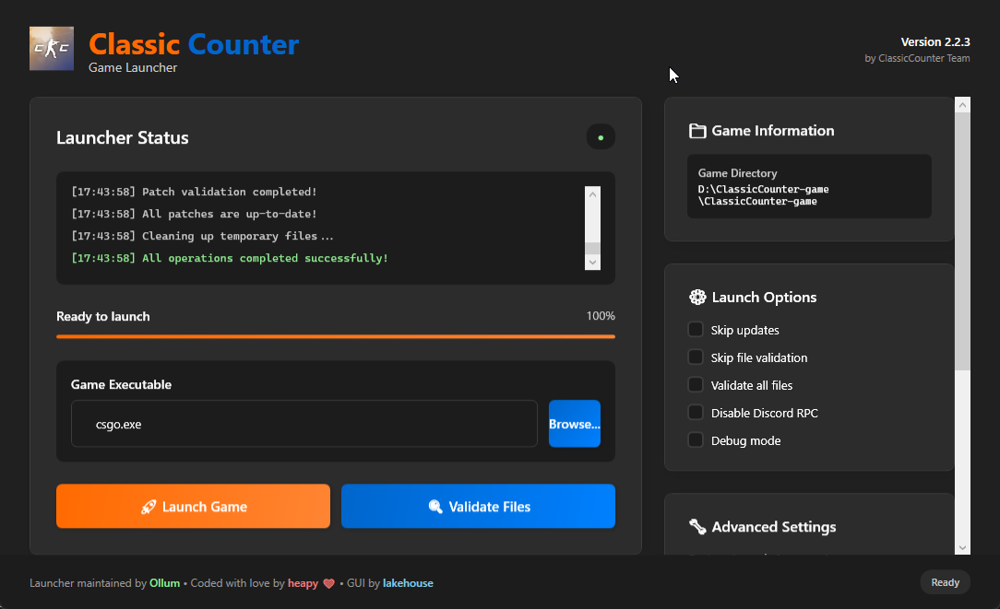

 <h2 align="center">ClassicCounter Launcher</h2>
 

   Modern GUI Launcher for ClassicCounter with Fluent Design, Discord RPC, Auto-Updates and More!
    
   Written in C# using .NET 8 with WPF and Windows 11 Fluent Design System.
 

[![Downloads][downloads-shield]][downloads-url]
[![Stars][stars-shield]][stars-url]
[![Issues][issues-shield]][issues-url]
[![MIT License][license-shield]][license-url]

  

## Features

- **Modern Fluent Design** - Beautiful Windows 11-inspired interface with smooth animations
- **Responsive Layout** - Scrollable sidebar and adaptive UI components  
- **Game Management** - Launch options, file validation, and game directory display
- **Auto-Updates** - Automatic launcher and game patch updates
- **Discord Integration** - Rich Presence support with game status
- **Self-Contained** - Standalone executable with all dependencies included
- **Code Signed** - Digitally signed for security and trust
- **Dual Mode** - GUI and console mode support

> [!IMPORTANT]
> **NEW:** This launcher now features a modern GUI! No .NET Runtime installation required - the executable is fully self-contained.

## Getting Started

1. **Download** the latest `launcher.exe` from [Releases](https://github.com/lakehouse445/launcher/releases)
2. **Run** the executable - no installation needed!
3. **Configure** your game path and launch options in the GUI
4. **Launch** ClassicCounter and enjoy!

## Arguments (Console Mode)

The launcher automatically detects if it should run in GUI or console mode. For console mode, use these arguments:

- `--debug-mode` - Enables debug mode, prints additional info.
- `--skip-updates` - Skips checking for launcher updates.
- `--skip-validating` - Skips validating patches.
- `--validate-all` - Validates all game files.
- `--patch-only` - Will only check for patches, won't open the game.
- `--disable-rpc` - Disables Discord RPC.

> [!CAUTION]
> **Using `--skip-updates` or `--skip-validating` is NOT recommended!**  
> **An outdated launcher or patches might cause issues.**

## GUI Features

- **Game Information** - Displays current game directory and status
- **Launch Options** - Easy checkboxes for all launcher settings
- **Advanced Settings** - Additional configuration options
- **Community Links** - Quick access to GitHub and Discord
- **Real-time Status** - Live updates and progress tracking
- **Launch Controls** - Validate files and launch game buttons

## Technical Details

- **Framework:** .NET 8.0 with WPF
- **UI Design:** Windows 11 Fluent Design System
- **Architecture:** MVVM pattern with separated business logic
- **Distribution:** Self-contained single-file executable
- **Code Signing:** Digitally signed for security
- **Compatibility:** Windows 7+ (x64)

## Packages Used

- [CSGSI](https://github.com/rakijah/CSGSI) by [rakijah](https://github.com/rakijah)
- [DiscordRichPresence](https://github.com/Lachee/discord-rpc-csharp) by [Lachee](https://github.com/Lachee)
- [Downloader](https://github.com/bezzad/Downloader) by [bezzad](https://github.com/bezzad)
- [Refit](https://github.com/reactiveui/refit) by [ReactiveUI](https://github.com/reactiveui)
- [Spectre.Console](https://github.com/spectreconsole/spectre.console) by [Spectre Console](https://github.com/spectreconsole)
- [Gameloop.Vdf](https://github.com/shravan2x/Gameloop.Vdf) by [shravan2x](https://github.com/shravan2x)
- [Microsoft.Xaml.Behaviors.Wpf](https://github.com/microsoft/XamlBehaviorsWpf) by [Microsoft](https://github.com/microsoft)

## Credits

**GUI Development by [lakehouse](https://github.com/lakehouse445)**

[downloads-shield]: https://img.shields.io/github/downloads/lakehouse445/launcher/total.svg?style=for-the-badge
[downloads-url]: https://github.com/lakehouse445/launcher/releases/latest
[stars-shield]: https://img.shields.io/github/stars/lakehouse445/launcher.svg?style=for-the-badge
[stars-url]: https://github.com/lakehouse445/launcher/stargazers
[issues-shield]: https://img.shields.io/github/issues/lakehouse445/launcher.svg?style=for-the-badge
[issues-url]: https://github.com/lakehouse445/launcher/issues
[license-shield]: https://img.shields.io/github/license/lakehouse445/launcher.svg?style=for-the-badge
[license-url]: https://github.com/lakehouse445/launcher/blob/master/LICENSE
